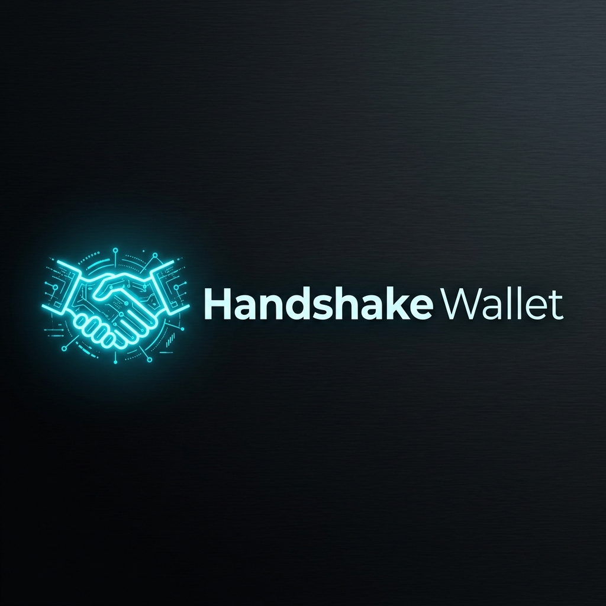

<p align="center"></p>

# Handshake Wallet: A Handshake Wallet and Full Node

Handshake Wallet is a [Handshake](https://handshake.org) wallet with an integrated full node.

**Status**: This is beta software. As with all wallet GUIs, please use with care, and at your own risk.

## How to Install Handshake Wallet

Most users should use the prebuilt binaries in this repo's [releases](https://github.com/webelity/hns-wallet/releases) page.

Always look for the [latest](https://github.com/webelity/hns-wallet/releases/latest) version.

* **OSX:** `.dmg` (x86 = Intel; arm64 = Apple Silicon)
* **Windows:** `.msi`
* **Linux:** `.AppImage`

For macOS users, Handshake Wallet is also available through the [Homebrew](https://github.com/homebrew/brew) package manager:

```bash
brew install webelity/hns-wallet
```

### Verify downloaded binaries

1. Download a _SHA256SUMS.asc_ file included into the release
2. Paste the file's content into https://keybase.io/verify and click "Verify"
3. Make sure the file's signer is a trusted signer mentioned in [SECURITY.md](SECURITY.md#trusted-pgp-keys)
4. Compare a checksum of a downloaded Handshake Wallet app file:
```
# Linux
sha256sum hns-wallet-2.1.4.AppImage

# Windows
certUtil -hashfile hns-wallet-2.1.4.msi SHA256

# macOS
shasum -a 256 hns-wallet-2.1.4-x86.dmg
shasum -a 256 hns-wallet-2.1.4-arm64.dmg
```

For more details and more advanced PGP signature verification see https://github.com/webelity/hns-wallet/pull/612.

## Uninstall

Handshake Wallet can be uninstalled from your OS apps list. This _does not_ delete any blockchain and wallet data.

To completely remove all stored data, delete the `hns-wallet` directory which can be found in _Settings -> General_. If Handshake Wallet was installed with brew, then `brew uninstall --zap webelity/hns-wallet` will do this for you.

>Since this deletes wallet data, be sure to **backup your seed phrases** first.

## Features

Handshake Wallet supports all of the following features:

1. Name auctions
2. DNS record management
3. Send/receive coins
4. Airdrop claims (Note that you need to wait 100 blocks before spending the airdrop reward)
5. Name watchlists
6. Transferring names
7. Multi-select bulk domain renewal
8. Domain manager UI sorting (Domain, Expires On, HNS Paid)
9. Right-click context menus

## Contributing

Contributions are most welcome.

Inquiries to integrate with hardware wallets, ecosystem DNS/website infrastructure, and offers to collaborate with other Handshake-aligned projects are also most welcome.

If you are an individual developer looking to add a feature, fix a bug, or create new documentation -- please feel free to reach out, even if just to say hello.  We are also exploring incentivization mechanisms, potentially ramping up from small bounties to ecosystem-funded full-time developers.

### Building From Source

Please see this [guide](https://gist.github.com/pinheadmz/314aed5123d29cb89bfc6a7db9f4d02e), courtesy of [@pinheadmz](https://github.com/pinheadmz).  It explains how to get set up in dev mode, and includes some helpful tips like (i) how to tail log output and (ii) how one can have a "personal mainnet" node while developing on a different Handshake Wallet instance.

Due to Ledger USB integration, additional dependencies are required:

#### OSX

If you are running OSX on an arm64 processor (aka "Apple Silicon" or "M1") it
is highly recommended to upgrade to Node.js v16
[which has arm64 support.](https://nodejs.org/en/blog/release/v16.0.0/#toolchain-and-compiler-upgrades)

Building for OSX requires one extra "optional" dependency (dmg-license)
[that can not currently be installed on Windows/Linux systems](https://github.com/electron-userland/electron-builder/issues/6520):

```bash
brew install libusb
git clone https://github.com/webelity/hns-wallet
cd hns-wallet
npm install
npm install dmg-license
```

Build the app package *for the native architecture of your Mac*:

```bash
npm run package-mac
```

If you are running OSX on an arm64 but want to build the executable for x86 (Intel)
Macs, you can do so but you must first downgrade to Node.js v14 or re-install Node.js v16
for x86 instead of arm64. Building for a non-native architecture will seriously impair
the performance of the application, so this option is only recommended for multi-platform
distribution by maintainers with M1 Macs. As an extra complication, this process must
be run in an environment where `libunbound` is available as an x86 package.

```bash
npm run package-mac-intel
```

The output app will be created in the `/release/mac` or `/release/mac-arm64` folder.
Open `Handshake Wallet.app` to start the wallet.


#### Linux

```bash
apt-get install libusb-1.0-0-dev libudev-dev
git clone https://github.com/webelity/hns-wallet
cd hns-wallet
npm install
```

Build the app package:

```bash
npm run package-linux
```

The output app will be created in the `/release` folder. Open `hns-wallet-x.x.x.AppImage` to start the wallet.

##### Ledger

Note that to use Ledger devices with Linux, permissions must be granted to access the USB device.
Follow Ledger's own guide [here](https://support.ledger.com/hc/en-us/articles/115005165269-Fix-connection-issues)
which will instruct you to execute this command:

```
wget -q -O - https://raw.githubusercontent.com/LedgerHQ/udev-rules/master/add_udev_rules.sh | sudo bash
```


#### Test in development mode

```bash
npm run dev
```


## Reporting Issues

**We have no officially sanctioned or administered support/development channels, so this list will be periodically updated as the community develops.**

### Non-Security Issues

Please report issues using Github issues on this repo. Please file bugs with the provided template.

### Security Issues

See [SECURITY.md](SECURITY.md#reporting-a-vulnerability).

## License

[GNU](LICENSE)
